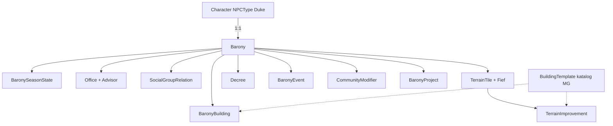

# Warstwa Zarządzania Baronią — Dokument Koncepcyjny

> Żywy dokument. Zbiera całą wiedzę projektową o warstwie "Zarządzanie Baronią".
> Formuły, listy budynków, wydarzeń itp. będą dopisywane w kolejnych iteracjach
> (oznaczone jako **[DO UZUPEŁNIENIA]**).

Branch roboczy: **`Duke`**.

---

## 1. Cel i założenia

Nowa warstwa aplikacji pozwalająca wybranym użytkownikom (Baronom) zarządzać
niewielką baronią. Rozgrywka jest **turowa** — jedna tura = jeden **sezon**.
Wszystkie statystyki, parametry i elementy baronii żyją w aplikacji.

### Rola / tożsamość Barona
- Baron = istniejąca rola Identity **`DukePlayer`** oraz typ postaci **`NPCType.Duke`**
  (już obecne w `DA_Common/SD.cs`). Nie tworzymy nowej roli.
- Jedna postać typu Duke/Baron = jedna baronia (relacja 1:1).
- Baronia jest wiązana z użytkownikiem pośrednio, przez `Character.UserName`.

---

## 2. Podstawowe Parametry Baronii (PPB)

Trzynaście parametrów. Kolumny wszystkich tabel na "Panelu Domeny" to właśnie PPB.

| # | Nazwa (PL) | Klucz (kod) | Kumuluje się między turami? |
|---|------------|-------------|------------------------------|
| 1 | Wyżywienie | Food | **tak** (akumulator) |
| 2 | Ekonomia | Economy | nie |
| 3 | Produkcja | Production | **tak** (akumulator) |
| 4 | Lojalność | Loyalty | nie |
| 5 | Stabilność | Stability | nie |
| 6 | Prawo | Law | nie |
| 7 | Korupcja | Corruption | nie |
| 8 | Nauka | Science | **tak** (akumulator) |
| 9 | Magia | Magic | **tak** (akumulator) |
| 10 | Kultura | Culture | **tak** (akumulator) |
| 11 | Wywiad | Intelligence | **tak** (akumulator) |
| 12 | Obrona | Defense | **tak** (akumulator) |
| 13 | Skarb / Złoto | Treasury | **tak** (akumulator) |

> Uwaga: Żywność w spichlerzach oraz Złoto w skarbcu to **akumulatory** — przenoszą
> się między turami. Flagę kumulacji trzymamy przy definicji PPB (`IsCumulative`).
> Podział "które dokładnie się kumulują" **[DO UZUPEŁNIENIA]** po dostarczeniu formuł.

---

## 3. Rdzeń: `PpbVector` i modyfikatory

Każda sekcja Panelu Domeny to tabela, w której **wiersze = modyfikatory**,
a **kolumny = PPB**. Aby to ujednolicić w kodzie:

- **`PpbVector`** — obiekt z 13 polami `decimal` (po jednym na PPB).
- Każde źródło modyfikatora ma dwa wektory:
  - `Additive` — dodaje płaską wartość do PPB,
  - `Percent` — modyfikuje PPB procentowo.
- Wzór podsumowania (wstępny, do potwierdzenia z formułami):

  ```
  wynikPPB = (bazaPPB + Σ Additive) * (1 + Σ Percent)
  ```

- Ten sam model zasila stronę **Budżet** (filtr do kolumny Skarb/Złoto, rozbicie
  na przychody/wydatki; procenty stosowane do wartości dodanej, nie do bilansu).

Wszystkie źródła modyfikatorów (doradcy, budynki, relacje społeczne, ulepszenia
terenu, dekrety, wydarzenia, kary społeczności) współdzielą `PpbVector`.

### Formuły — podejście hybrydowe
- v1: obliczenia zaszyte w C#, obok zapisany **czytelny tekst formuły** do podglądu
  (tooltip/hover), np. `Złoto = (Społeczeństwo * 2 + Ekonomia) / (Niepokój + Korupcja)`.
- MG może w przyszłości edytować formuły; pełny silnik wyrażeń ewaluowany z DB
  to **osobna, późniejsza faza**.

---

## 4. Strony

### 4.1 Panel Domeny (`/barony`) — strona bazowa
Zbiera i podsumowuje dane z pozostałych stron. Podzielona na **rozwijane sekcje**;
każda sekcja to tabela PPB. Nierozwinięta sekcja pokazuje tylko wiersz
podsumowania PPB. Globalny przełącznik domyślnego stanu:
- włączony → sekcje domyślnie rozwinięte (dopóki użytkownik nie zwinie),
- wyłączony → sekcje domyślnie zwinięte (dopóki użytkownik nie rozwinie).

Sekcje:
1. **Ogólny / Informacyjny** — Rok, Miesiąc, Tura, Sezon, Złoto w skarbcu,
   Niepokój, Rozmiar baronii, Produkcja w turze, Wyżywienie w turze,
   Żywność w spichlerzach, Przyrost, DC Kontroli baronii, Lojalność,
   Stabilność, Ekonomia. Część wartości to odnośniki do wyliczeń z innych sekcji.
2. **Baron i doradcy** — postacie wpływające na baronię; każda rola wpływa na PPB
   procentowo lub addytywnie.
3. **Miasto i budynki** — lista działających budynków/ulepszeń w mieście głównym;
   każdy ma unikalny wpływ na PPB. Można dodać nowy budynek z listy dostępnych.
4. **Relacje z grupami społecznymi** — szlachta, mieszczaństwo, chłopi. Relacja
   startowa: obojętność; zmiany relacji generują zmiany PPB wg formuły **[DO UZUPEŁNIENIA]**.
5. **Ulepszenia terenu** — jak "Miasto i budynki", ale ograniczone liczbą pól;
   każde pole ma parametry (żyzność, zasób, typ). Efekt ulepszenia zależy od pola
   (np. farma daje więcej na polu żyznym; tartak tylko na lesie; kopalnia tylko na
   polu z zasobem). Formuła **[DO UZUPEŁNIENIA]**.
6. **Dekrety i technologie** — bonusy do PPB definiowane przez MG w porozumieniu
   z graczem (wiersze = dekrety, kolumny = PPB).
7. **Wydarzenia** — wpisywane przez MG (gracz nie ma wpływu), wpływ na PPB.
8. **Kary i bonusy społeczności** — wpływ społeczeństwa, głodu, przestępczości,
   korupcji, niepokoju na PPB.
9. **Podsumowanie** — dokładne zebranie wszystkich sekcji. Nie jest to zwykła suma:
   doradcy mogą modyfikować procentowo, dodawać wartość do sumy, lub łączyć oba
   sposoby. Formuły **[DO UZUPEŁNIENIA]**.

Dla użytkowników typu Baron: dolny pasek **"Karty Baronii"** (jak zakładki Excela).

### 4.2 Zasoby (`/barony/resources`)
Podsumowanie przychodów i wydatków PPB oraz obliczenie aktualnego stanu zasobów.
Sumuje: dochody z tury, poprzednie zapasy, projekty, inne przychody (przygody
barona, wydarzenia).

### 4.3 Budżet (`/barony/budget`)
Poświęcona wyłącznie **złotu**. Podział na przychody i wydatki.
- Źródła **przychodów**: Ekonomia (bezpośrednie przełożenie na dochód w turze),
  Leno (dochody od lenników), Miasto i budynki, Ulepszenia, Dekrety i technologie,
  Wydarzenia, Inne.
- Źródła **wydatków**: te same + **Doradcy**. W wydatkach tylko źródła odejmujące
  złoto; w dochodach — dodające.
- Modyfikatory (np. baron dobry w zwiększaniu dochodów) to **modyfikator procentowy
  stosowany do wartości dodanej**, nie do całego bilansu.
- Na stronie: pełny bilans, **kiesa barona** oraz **skarbiec baronii** (dwie różne
  wartości; baron może przelewać między nimi bez ograniczeń).

### 4.4 Projekty (`/barony/projects`)
Pomysły baronów zamieniane w projekty: spełnienie warunków (alokacja zasobów) →
rezultat (inne zasoby, budowa ulepszenia, szlak handlowy, karawana itp.).
- Duża tabela: nazwa, koszt w PPB, rezultat w PPB, opis rezultatu.
- Mechanizm **alokacji zasobów** dla gracza (by spełnić warunki startu).
- **Tracking postępów** (projekt może trwać kilka tur): np. "rozpoczęty,
  zaalokowano 80% zasobów, czas do zakończenia: 2 tury".
- Edytowalne dla MG, do wglądu dla gracza.

### 4.5 Budynki i Ulepszenia (`/barony/buildings`)
Katalog (wielka tabela/lista) możliwych do zbudowania budynków i ulepszeń terenu.
Kolumny: nazwa, rodzaj (budynek / ulepszenie), koszt w złocie, koszt w produkcji,
wpływ na PPB, opis. Pełna lista budynków **[DO UZUPEŁNIENIA]**.

### 4.6 Urzędy (`/barony/offices`)
Doradcy barona i ich umiejętności zarządcze (te same nazwy co PPB umiejętnościowe:
Wyżywienie, Ekonomia, Produkcja, Lojalność, Stabilność, Prawo, Korupcja, Nauka,
Magia, Kultura, Wywiad, Obrona). Baron też ma te umiejętności — ekstrapolowane
z jego postaci (formuła **[DO UZUPEŁNIENIA]**).

Trzy podstawowe urzędy:
- **Kanclerz** — dyplomacja, listy, zarządzanie dworem; wpływa na Lojalność,
  Stabilność, Kulturę. Pierwsza postać po baronie.
- **Kapitan Straży** — bezpieczeństwo, szkolenie wojska i straży, pierwszy generał;
  wpływa na Prawo, Korupcję, Obronę.
- **Ekonom** — ekonomia i produkcja; wpływa na Ekonomię, Produkcję, Wyżywienie.

Każdy urząd ma darmowego **asystenta** dodającego bonus do umiejętności urzędnika.
Można dodawać kolejne urzędy/doradców, ale rośnie koszt oraz korupcja.

### 4.7 Tereny Baronii (`/barony/terrain`)
Mapka/siatka kwadratów. Każde pole:
- **rodzaj bazowy**: równiny, wzgórza, góry;
- **dodatki** (mogą się łączyć): las, wybrzeże, rzeka, pustkowie/pustynia, bagna;
- **żyzność** (dla równin/wzgórz): 0 (pustkowie) — 5 (bardzo żyzne);
- **zasób** (opcjonalny): kamień, metale miękkie, żelazo, glina, obsydian, ...
  (dużo do wyboru, możliwość wpisania własnego);
- **ulepszenie** zbudowane na polu, komentarze.

Interakcja: klik w kwadrat → podgląd rodzaju terenu, żyzności, ulepszenia, komentarzy.
Lista terenów z ulepszeniami zawiera też **przynależność lenną** (bezpośrednia
i pośrednia). Baron rozdaje ziemie lennikom; każdy lennik zarządza 5–9 kwadratami,
baron ~5. Ulepszenia na terenach lenników dają **pomniejszone** bonusy
(formuła **[DO UZUPEŁNIENIA]**).

### 4.8 Karta Barona (`/barony/character-card`)
Rozszerzenie postaci barona: obliczane parametry wpływu na baronię (kultura,
stabilność itp.) oraz **prestiż, honor, postrach** (też wpływają na baronię).
Tabelki z trofeami, biblioteczką itp.

---

## 5. Model danych (wysoki poziom)



Wszystkie źródła modyfikatorów przechowują `PpbVector` (Additive + Percent).
Encje w `DA_DataAccess`, DTO w `DA_Models`, repozytoria w `DA_Business`,
rejestracja w `DagoniteEmpire/Program.cs`. Wektory zapisywane jako owned type / JSON
(wzorem `BattleMap.CellsJson`).

---

## 6. Styl UI

- MudBlazor 9.4.0. Motyw stonowany, czytelny, **bez fioletów i pstrokacizny**:
  paleta pergamin/łupek + stonowany złoty akcent.
- Zmiany wizualne ograniczone do stron baronii (bez ruszania istniejących stron) —
  osobny `barony.css` + klasy scope.
- Strona-laboratorium stylów (dev/GM only): warianty tabel PPB + generyczna
  "Karta Baronii" do wyboru.
- Generyczny komponent sekcji rozwijanej z globalnym przełącznikiem domyślnego stanu.
- Dolny pasek "Karty Baronii" (zakładki jak w Excelu) dla Baronów.

---

## 7. Konwencje techniczne (skrót)

- .NET 9, Blazor Server (interactive), MudBlazor 9.4.0, EF Core + PostgreSQL.
- Wzorzec repozytorium operujący na DTO + AutoMapper (`DA_Business/Mapper/MappingProfile.cs`).
  Brak Unit of Work — każda metoda tworzy własny kontekst z `IDbContextFactory`.
- Nawigacja ręczna: wpisy w `Shared/CharacterNavButtons.razor`.
- Migracje:
  `dotnet ef migrations add <Nazwa> --project DA_DataAccess --startup-project DagoniteEmpire`.

---

## 8. Do uzupełnienia (kolejne prompty)

- [ ] Dokładne formuły wszystkich PPB i podsumowania.
- [ ] Które PPB dokładnie się kumulują między turami.
- [ ] Formuła relacji z grupami społecznymi.
- [ ] Formuła ulepszeń terenu zależna od parametrów pola.
- [ ] Pełna lista budynków i ulepszeń + ich wpływ na PPB.
- [ ] Formuła ekstrapolacji umiejętności barona z jego postaci.
- [ ] Formuła bonusów z terenów lenników (pomniejszenie).
- [ ] Zasady prestiżu / honoru / postrachu i ich wpływu na baronię.
